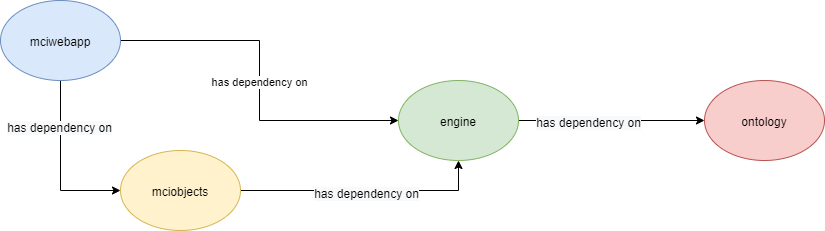

# MCI

 

---
## Tech
* [Opend Jdk 12]
* [Spring]
* [Apache Jena]
* [Openllet]

---
## Maven Projects

### [ontology](./ontology)
Περιέχει το maven artifact το οποίο χειρίζεται την εκτέλεση ερωτημάτων σε έναν *Apache Fuseki* server. Περισσότερες λεπτομέρειες στο [README](./ontology/README.md)

### [engine](./engine)
Περιέχει το maven artifact το οποίο αποτελεί την μηχανή της δημιουργίας των SPARQL ερωτημάτων, της δημιουργίας/ανάγνωσης των κανόνων της οντολογίας. Τέλος παρέχει ένα abstraction layer για την δημιουργία/ανάγνωση game αντικειμένων και game objects. Περισσότερες λεπτομέρειες στο [README](./engine/README.md)

### [mciobjects](./mciobjects)
Περιέχει το maven artifact το οποίο χειρίζεται την δημιουργία και την ανάγνωση μόνο των game objects. Περισσότερες λεπτομέρειες στο [README](./engine/README.md)

### [mciwebapp](./mciwebapp)
Περιέχει το maven webapp artifact. Το project αυτό περιέχει τους REST Controllers για την δημιουργία και την ανάγνωση παιγνίων. Περισσότερες λεπτομέρειες στο [README](./mciwebapp/README.md)

## Topology
Η παρακάτω εικόνα δείχνει τα dependencies μεταξύ των projects

---
## Eγκατάσταση
Για την εγκατάσταση της εφαρμογής ακολουθούνται τα βήματα των παρακάτω οδηγών εγκατάστασης:

1. [Tomcat](docs/tomcatSetup.md)
2. [Apache Fuseki](docs/fusekiSetup.md)
3. [Οντολογία](docs/ontologyInstall.md)
4. [Αντικείμενα Οντολογίας](mciobjects/README.md)
5. [Εφαρμογή MCI](mciwebapp/README.md)

---
### NOTE
Η εφαρμογή MCI απαιτεί [Opend Jdk 12] .

---

# [Apache License 2.0]

[//]: # (These are reference links used in the body of this note and get stripped out when the markdown processor does its job. There is no need to format nicely because it shouldn't be seen. Thanks SO - http://stackoverflow.com/questions/4823468/store-comments-in-markdown-syntax)

   [Opend Jdk 12]: <https://openjdk.java.net/projects/jdk/12/>
   [Spring]: <https://spring.io/projects/spring-framework>
   [Apache Jena]: <https://jena.apache.org/index.html>
   [Openllet]: <https://github.com/Galigator/openllet>
   [Apache License 2.0]: <https://github.com/Binarios/Mci/blob/master/LICENSE>
