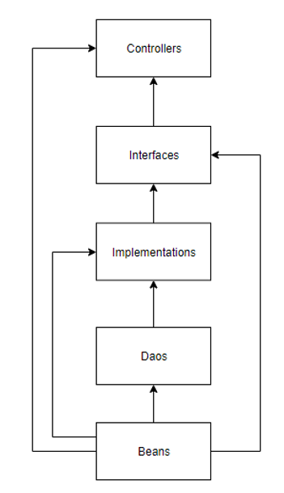

# Mci Webapp
Το project mciwebapp περιέχει την λογική για την δημιουργία νέου στιγμιότυπου ενός παιγνίου, 
για την λύση του ή για την ανάγνωση του.

---
## Δομή Project
Το project έχει ως κυρίως package το `com.aegean.icsd.mciwebapp`.
Συγκεκριμένα στο package αυτό υπάρχουν τα εξής δύο αρχεία:
1. `WebAppConfig`: Η κλάση αυτή περιέχει το configuration για το Spring WebApp, όπως κάποιον custom deserializer
2. `ServletContextInit`: Η κλάση αυτή περιέχει το initialization process για το Spring Context.
Η κλάση αυτή είναι απαραίτητη για την σωστή εκτέλεση του Spring MVC

Στη συνέχεια κάθε παίγνιο αναπτύσσεται σε ξεχωριστό package, με σκοπό την απομόνωση της λειτουργίας του κάθε παίγνιο.
Το project για κάθε παίγνιο έχει την παρακάτω δομή:
1. `beans`: περιέχει τα Java Beans, που χρησιμοποιούνται από τα υπόλοιπα projects  
2. `controllers`: περιέχει τις κλάσεις, που λειτουργούν ως `RestControllers`
3. `dao`: περιέχει τις κλάσεις, που έχουν πρόσβαση στο maven project [ontology](./ontology/README.md)
με σκοπό την εκτέλεση SPARQL ερωτημάτων
4. `implementations`: περιέχει την υλοποίηση της λογικής του παιγνίου
5. `interfaces`: περιέχει την διεπαφή της υλοποίησης η οποία μπορεί να χρησιμοποιηθέι από τους controllers

Η παρακάτω εικόνα παρουσιάζει τα dependencies μεταξύ των πακέτων:

---
## Εγκατάσταση
Για την εγκατάσταση του WebApp πρώτα πρέπει να εγκατασταθούν τα παρακάτω
1. Ένας Tomcat server, όπως έχει περιγραφεί [εδώ](../docs/tomcatSetup.md)
2. Apache Fuseki, όπως έχει περιγραφεί [εδώ](../docs/fusekiSetup.md)
3. Η οντολογία εγκαταστημένη, όπως έχει περιγραφεί [εδώ](../docs/ontologyInstall.md)
4. Τα αντικείμενα της οντολογίας, όπως έχει περιγραφεί [εδώ](../mciobjects/README.md) 

Εφόσον τα παραπάνω έχουν εγκατασταθεί τότε εκτελούμε τα παρακάτω βήματα:

1. Git clone: `git clone https://github.com/Binarios/Mci.git `
2. Ανοίγουμε cmd στην τοποθεσία που κάναμε *git clone*
3. Εκτελούμε `mvn clean install`, το οποίο εγκατηστά όλα τα dependencies, κάνει build, τρέχει τα Unit Tests και τέλος παράγει το `war` αρχείο της εφαρμογής
4. Αντιγράφουμε τον φάκελο από την τοποθεσία `./mciwebapp/target/mci` στην τοποθεσία όπου έχουμε εγκαταστήσει
τον Tomcat server (σύμφωνα με τον [οδηγό εγκατάστασης](../docs/tomcatSetup.md)), στον φάκελο `webapps`.
Το directory στον Tomcat που θα περιέχει το webapp πρέπει να έχει την εξής μορφή `${tomcat_path}/webapps/mci`.
5. Εκτελούμε τον [Apache Fuseki server](../docs/fusekiSetup.md) και όταν έχει ξεκινήσει, τότε εκτέλουμε τον [Tomcat server](../docs/tomcatSetup.md) που περιέχει την εφαρμογή.
6. Τέλος μπορεί να χρησιμοποιηθεί το [Postman Collection](../resources/MCI.postman_collection.json), σύμφωνα με τον [οδηγό εγκατάστασης](../resources/postmanCollection.md), για την εκτέλεση των requests

***Προσοχή!*** Αντιγράφουμε τον παραγώμενο φάκελο της εφαρμογής και όχι το war αρχείο. 
